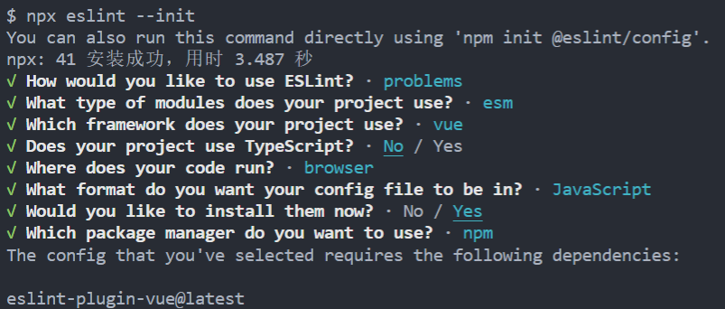
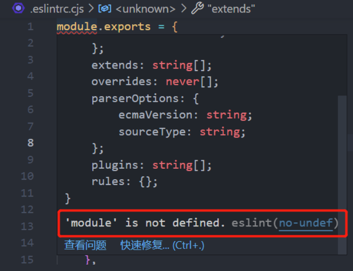

## 创建项目

兼容性注意

Vite 需要 [Node.js](https://nodejs.org/en/) 版本 14.18+，16+。然而，有些模板需要依赖更高的 Node 版本才能正常运行，当你的包管理器发出警告时，请注意升级你的 Node 版本。

node 版本: v14.18.2

npm 版本: 6.14.15

使用 NPM:

```
npm create vite@latest
```

["npm create vite" 是怎么实现初始化 Vite 项目？](https://juejin.cn/post/7173609541483888670)

[Node.js 如何处理 ES6 模块](https://www.ruanyifeng.com/blog/2020/08/how-nodejs-use-es6-module.html)

## IDE 支持

- 推荐使用的 IDE 是 [VSCode](https://code.visualstudio.com/)，配合 [Vue 语言特性 (Volar)](https://marketplace.visualstudio.com/items?itemName=Vue.volar) 插件。该插件提供了语法高亮、TypeScript 支持，以及模板内表达式与组件 props 的智能提示。

  提示

  Volar 取代了我们之前为 Vue 2 提供的官方 VSCode 扩展 [Vetur](https://marketplace.visualstudio.com/items?itemName=octref.vetur)。如果你之前已经安装了 Vetur，请确保在 Vue 3 的项目中禁用它。

## 浏览器开发者插件

Vue 的浏览器开发者插件使我们可以浏览一个 Vue 应用的组件树，查看各个组件的状态，追踪状态管理的事件，还可以进行组件性能分析。


- [文档](https://devtools.vuejs.org/)
- [Chrome 插件商店页](https://chrome.google.com/webstore/detail/vuejs-devtools/nhdogjmejiglipccpnnnanhbledajbpd)
- [Firefox 所属插件页](https://addons.mozilla.org/en-US/firefox/addon/vue-js-devtools/)

## 代码规范

### 配置 Eslint

[ESLint](https://zh-hans.eslint.org/) 一个插件化的 javascript 代码检测工具

Vue 团队维护着 [eslint-plugin-vue](https://eslint.vuejs.org/) 项目，它是一个 ESLint 插件，会提供 SFC 相关规则的定义。

#### 安装

```
npm install -D eslint
```

#### 初始化 Eslint

```
npx eslint --init
```



#### 问题解决

此时查看 .eslintrc.cjs 会有报错



```
module.exports = {
  "env": {
    "browser": true,
    "es2021": true,
+   "node": true // 新增
  },
  ...
}
```

#### 添加 eslint:fix 命令

```
// package.json
{
  "scripts": {
    "eslint:fix": "eslint src --ext .js,.vue --fix"
  }
}
```

#### 安装 VsCode 插件

安装 [Eslint](https://marketplace.visualstudio.com/items?itemName=dbaeumer.vscode-eslint) 插件, 自动执行 lint 命令显示和修复代码错误

新建.vscode/settings.json 文件

```
{
  // 开启自动修复
  "editor.codeActionsOnSave": {
    "source.fixAll": false,
    "source.fixAll.eslint": true
  }
}
```

### 配置 Prettier

[Prettier](https://prettier.io/) 主要是对代码进行格式化, 虽然 ESLint 也可以, 但是 Prettier 比较专业, 所以 ESLint 经常结合 Prettier 一起使用

#### 安装

```
npm install -D prettier
```

#### 配置文件

根目录新建 .prettierrc.cjs (因为 vite 默认使用了 "type": "module", 所以要以 cjs 后缀结尾)

```
module.exports = {
  printWidth: 80, // 一行的字符数，如果超过会进行换行，默认为80
  tabWidth: 2, // 一个tab代表几个空格数，默认为80
  useTabs: false, // 是否使用tab进行缩进，默认为false，表示用空格进行缩减
  singleQuote: true, // 字符串是否使用单引号，默认为false，使用双引号
  semi: false, // 行位是否使用分号，默认为true
  trailingComma: 'none', // 是否使用尾逗号，有三个可选值"<none|es5|all>"
  bracketSpacing: true // 对象大括号直接是否有空格，默认为true，效果：{ foo: bar }
}
```

#### 添加 prettier:fix 命令

```
// package.json
{
  "scripts": {
    "prettier:fix": "prettier --write ./src/**/*.{scss,js,json,vue}"
  }
}
```

#### 安装 VsCode 插件

安装 [Prettier - Code formatter](https://marketplace.visualstudio.com/items?itemName=esbenp.prettier-vscode) 插件, 保存的时候自动完成格式化

在 .vscode/settings.json 文件中添加规则

```
{
  // 保存的时候自动格式化
  "editor.formatOnSave": true,
  // 默认格式化工具选择prettier
  "editor.defaultFormatter": "esbenp.prettier-vscode"
}
```

### 解决 eslint 与 prettier 的冲突

eslint 部分规则与 prettier 部分规则会产生冲突，保存的时候显示运行了 eslint 的修复命令，然后再运行 prettier 格式化，所以就会出现屏幕闪一下然后又恢复到报错的现象

社区已经为我们提供了一个非常成熟的方案，即 eslint-config-prettier + eslint-plugin-prettier

- [eslint-plugin-prettier](https://github.com/prettier/eslint-plugin-prettier)： 基于 prettier 代码风格的 eslint 规则，即 eslint 使用 pretter 规则来格式化代码

- [eslint-config-prettier](https://github.com/prettier/eslint-config-prettier)： 禁用所有与格式相关的 eslint 规则，解决 prettier 与 eslint 规则冲突，**确保将其放在 extends 队列最后，这样它将覆盖其他配置**

#### 安装

```
npm install -D eslint-config-prettier eslint-plugin-prettier
```

#### 配置文件

修改 .eslintrc.cjs 文件中的 extends 配置项

```
{
  extends: [
    'eslint:recommended',
    'plugin:vue/vue3-essential',
+   'plugin:prettier/recommended' // 必须放在最后面
  ],
}
```

### 配置 Stylelint

[Stylelint](https://stylelint.docschina.org/) 是一个 css 的 lint 工具。可格式化 css 代码，检查 css 语法错误与不合理的写法，指定 css 书写顺序等

#### 安装

```
npm install -D stylelint postcss-scss postcss-html stylelint-config-prettier stylelint-scss stylelint-config-standard-scss stylelint-config-recommended-vue stylelint-config-recess-order
```

依赖说明

- [stylelint](<(https://stylelint.docschina.org/)>): css 样式 lint 工具

- [postcss](https://www.postcss.com.cn/): 转换 css 代码工具

- [postcss-scss](https://github.com/postcss/postcss-scss): 识别 scss 语法

- [postcss-html](https://github.com/gucong3000/postcss-html): 识别 html/vue 中的 <style></style> 标签中的样式

- [stylelint-config-prettier](https://github.com/prettier/stylelint-config-prettier): 关闭所有不必要或可能与 Prettier 冲突的规则

- [stylelint-config-recommended-scss](https://github.com/stylelint-scss/stylelint-config-standard-scss): scss 的推荐可共享配置规则

- [stylelint-config-standard-vue](https://github.com/ota-meshi/stylelint-config-standard-vue): lint .vue 文件的样式配置

- [stylelint-config-recess-order](https://github.com/stormwarning/stylelint-config-recess-order): 自动排序 CSS

#### 配置文件

根目录新建 .stylelintrc.cjs (因为 vite 默认使用了 "type": "module", 所以要以 cjs 后缀结尾)

```
module.exports = {
  extends: [
    'stylelint-config-prettier',
    'stylelint-config-standard-scss',
    'stylelint-config-recommended-vue/scss',
    'stylelint-config-recess-order'
  ],
  ignoreFiles: [],
  rules: {}
}
```

#### 添加 style:fix 命令

```
// package.json
{
  "scripts": {
    "style:fix": "stylelint \"src/**/*.{css,scss,vue}\" --fix"
  }
}
```

#### 安装 VsCode 插件

安装 [Stylelint](https://marketplace.visualstudio.com/items?itemName=stylelint.vscode-stylelint) 插件, 保存代码时自动执行 stylelint

在 .vscode/settings.json 文件中添加规则

```
{
  // 开启自动修复
  "editor.codeActionsOnSave": {
    "source.fixAll": false,
    "source.fixAll.eslint": true,
+   "source.fixAll.stylelint": true
  },
  // 保存的时候自动格式化
  "editor.formatOnSave": true,
  // 默认格式化工具选择 prettier
  "editor.defaultFormatter": "esbenp.prettier-vscode",
  // stylelint 校验的文件格式
+ "stylelint.validate": ["css", "scss", "vue"]
}
```

### 配置 ls-lint

[ls-lint](https://stylelint.docschina.org/) 是一个极快的文件和目录名称 linter。ls-lint 提供了简单且快速的方式，来为你的项目目录结构和文件名，提供极快的命名规则约束。

#### 安装

```
npm install -D @ls-lint/ls-lint

```

#### 配置文件

根目录新建 .ls-lint.yml

<!-- prettier-ignore-start -->
```
ls:
  src:
    .dir: kebab-case
    .scss: kebab-case
    .js: kebab-case
    .json: kebab-case
    .png: snake_case
    .jpg: snake_case
    .gif: snake_case
    .webp: snake_case

  src/**/views:
    .vue: kebab-case

  src/**/components:
    .vue: PascalCase

# 一些需要忽略检查的文件
ignore:
  - .git
  - .vscode
  - dist
  - node_modules
```
<!-- prettier-ignore-end -->

#### 添加 ls-lint 命令

```
// package.json
{
  "scripts": {
    "ls-lint": "ls-lint",
  }
}
```

### 配置 Husky

[husky](https://typicode.github.io/husky/#/) 的作用是拦截 git commit 命令，进行代码 lint 和格式检查等，只有确保通过检查才允许正常提交代码。

#### 安装

```
npx husky-init && npm install
```

#### 添加 npm 钩子

[npm scripts 使用指南](https://www.ruanyifeng.com/blog/2016/10/npm_scripts.html)

这时 package.json 会自动新增下面的钩子

```
{
  "scripts": {
    "prepare": "husky install"
  },
}
```

同时在项目根目录下会自动新增 .husky 目录, 并且有一个名为 pre-commit 的文件，里面包含了 git commit 前要执行的脚本。

### 配置 lint-staged

[lint-staged](https://github.com/okonet/lint-staged) 可以实现只对存入暂存区的文件进行 Lint 检查

#### 安装

```
npm install -D lint-staged
```

#### 配置

修改 package.json 新增

```
{
  "scripts": {
    "lint-staged": "lint-staged"
  },

  ...

  "lint-staged": {
    "src/**/*.{scss,js,vue}": [
      "npm run format:all",
      "git add ."
    ]
  },
}
```

同时修改 .husky 目录下 pre-commit 的文件

```
#!/usr/bin/env sh
  . "$(dirname -- "$0")/_/husky.sh"

- npm test
+ npm run ls-lint && npm run lint-staged
```

### 配置 commitlint

[commitlint](https://commitlint.js.org/#/) 用于提交时规范 commit 信息，规范和统一的 commit 信息能够方便团队协作和问题定位。

#### 安装

```
npm install -D @commitlint/cli @commitlint/config-conventional
```

#### 配置 .commitlintrc.cjs

在根目录创建 .commitlintrc.cjs

使用 @commitlint/config-conventional 规范集

```
// .commitlintrc.cjs
module.exports = {
  extends: ['@commitlint/config-conventional'],
  rules: {
    // Header
    'header-max-length': [2, 'always', 64],
    // <type>枚举
    'type-enum': [
      2,
      'always',
      [
        'init',
        'feat',
        'ui',
        'fix',
        'perf',
        'refactor',
        'chore',
        'add',
        'del',
        'style',
        'docs',
        'test',
        'revert',
        'replace',
        'deploy'
      ]
    ],
    // <type> 不能为空
    'type-empty': [2, 'never'],
    // <type> 格式 小写
    'type-case': [2, 'always', 'lower-case'],
    // <scope> 不能为空
    'scope-empty': [2, 'always'],
    // <scope> 格式 小写
    'scope-case': [2, 'always', 'lower-case'],
    // <subject> 不能为空
    'subject-empty': [2, 'never'],
    // <subject> 以.为结束标志
    'subject-full-stop': [2, 'never', '.'],
    // <subject> 格式
    // 可选值
    // 'lower-case' 小写 lowercase
    // 'upper-case' 大写 UPPERCASE
    // 'camel-case' 小驼峰 camelCase
    // 'kebab-case' 短横线 kebab-case
    // 'pascal-case' 大驼峰 PascalCase
    // 'sentence-case' 首字母大写 Sentence case
    // 'snake-case' 下划线 snake_case
    // 'start-case' 所有首字母大写 start-case
    'subject-case': [2, 'never', []],
    // <body> 以空行开头
    'body-leading-blank': [1, 'always'],
    // <footer> 以空行开头
    'footer-leading-blank': [1, 'always']
  }
};
```

#### 配置 Husky 钩子

将 commitlint 的功能集成到 Husky 的钩子当中, 执行下面的命令会在 .husky 创建 commit-msg 文件

```
npx husky add .husky/commit-msg 'npx --no -- commitlint --edit "$1"'
```

如果运行命令失败, 可手动在根目录下新建.husky/commit-msg 文件

```
#!/bin/sh
. "$(dirname "$0")/_/husky.sh"

npx --no-install commitlint --edit $1
```

### 配置 commitizen

[commitizen](https://github.com/commitizen/cz-cli) 会提供 git cz 命令替代我们的 git commit 命令，帮助我们更加方便生成符合规范的 commit message。

[cz-customizable](https://github.com/leoforfree/cz-customizable) 适配器可以定制项目的提交说明

#### 安装

```
npm install -g commitizen
npm install -D cz-customizable
```

#### 配置

修改 package.json 新增

```
{
  "scripts": {
    "commit": "git cz"
  },

  ...

  "config": {
    "commitizen": {
      "path": "node_modules/cz-customizable"
    },
    "cz-customizable": {
      "config": ".cz-config.cjs"
    }
  }
}
```

根目录新建 .cz-config.cjs

```
module.exports = {
  types: [
    { value: 'init', name: '🎉init: 初始提交' },
    { value: 'feat', name: '✨feat: 增加新功能' },
    { value: 'ui', name: '🌻ui: 更新UI' },
    { value: 'fix', name: '🐛fix: 修复bug' },
    { value: 'perf', name: '⚡️perf: 性能优化' },
    { value: 'refactor', name: '♻️refactor: 代码重构' },
    { value: 'chore', name: '🛠️chore: 更改配置文件' },
    { value: 'add', name: '➕add: 添加依赖' },
    { value: 'del', name: '❌del: 删除代码/文件' },
    { value: 'style', name: '🎨style: 样式修改不影响逻辑' },
    { value: 'docs', name: '📝docs: 修改文档' },
    { value: 'test', name: '✅test: 增加测试' },
    { value: 'revert', name: '⏪revert: 版本回退' },
    { value: 'release', name: '⌨️release: 发布' },
    { value: 'deploy', name: '👷deploy: 部署' }
  ],
  messages: {
    type: '选择更改类型:\n',
    subject: '简短描述:\n',
    body: '详细描述. 使用"|"换行:\n',
    confirmCommit: '确认提交?'
  },
  skipQuestions: ['scope', 'footer']
};
```

执行 git cz 或者 npm run commit 提交代码
